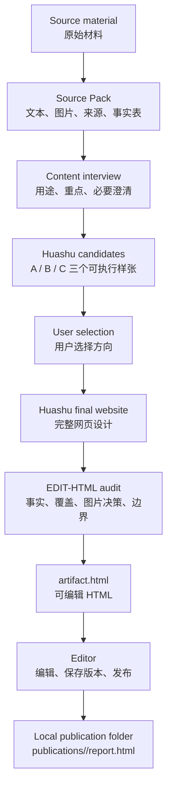
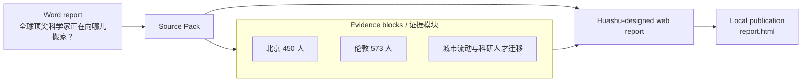

# EDIT-HTML

EDIT-HTML is a source-closed workflow for turning DOCX, PDF, PPTX, Markdown, HTML, or TXT material into a Huashu-designed, editable, versioned offline HTML report.

EDIT-HTML 是一个“材料闭环”的网页报告生成流程：把 DOCX、PDF、PPTX、Markdown、HTML 或 TXT 转成由花叔 Design 负责设计、可编辑、可保存版本、可本地发布的 HTML 报告。

## V5.3.2 focus

- Huashu owns the actual website design: layout, DOM, CSS, interaction, visualization, responsiveness, and narrative structure.
- EDIT-HTML owns extraction, provenance, audit, instrumentation, editor runtime, versioning, and publication.
- Candidate selection is explicit: the user must choose A/B/C before final production.
- Source images are judged, not blindly copied. High-value evidence images should be used or redrawn; low-value or repetitive images may be omitted.
- The editor saves immutable versions and local publications.
- V5.3.2 includes a local-folder-open patch: Windows now opens the concrete publication folder instead of a generic Documents-level location.

## V5.3.2 重点

- 花叔 Design 拥有真实网页设计权：布局、DOM、CSS、交互、可视化、响应式和叙事结构。
- EDIT-HTML 负责材料提取、溯源、审计、HTML 注入、编辑器运行时、版本保存和发布。
- 候选稿必须由用户明确选择 A/B/C，不能由模型自动确认。
- 原图使用需要判断，不是按数量搬运。高价值证据图应使用或重绘，低价值、重复或装饰性图片可以省略。
- 编辑器保存的是不可变版本，本地发布会生成独立 publication 文件夹。
- V5.3.2 包含本地文件夹打开补丁：Windows 会打开具体发布目录，而不是退到“文档”等上层目录。

## Workflow / 流程



Example from the “报告中转站” test material:



## Install

```powershell
npm install
npm run install:local
```

The npm package and CLI command remain `edit-html-report` for compatibility. The Codex Skill name is `EDIT-HTML`.

为保持兼容，npm 包名和 CLI 命令仍为 `edit-html-report`；Codex Skill 名称为 `EDIT-HTML`。

## Basic usage

```powershell
edit-html-report doctor
edit-html-report create "input.docx" --out "my-report"
edit-html-report variant create "my-report"
```

Then follow the V5.3.2 Skill workflow:

1. Inspect the Source Pack and warnings.
2. Ask only content questions: purpose, content weight, and necessary clarification.
3. Start the Huashu candidate stage.
4. Show A/B/C screenshots and wait for user selection.
5. Start the Huashu final stage from the selected candidate.
6. Import, verify, render, validate, and open the editor.
7. Save a version, publish locally, and open the local publication folder.

## Boundaries / 边界

EDIT-HTML must not redesign Huashu output during audit or instrumentation. Audit failures are diagnostics; they do not authorize silent layout, wording, chart, or interaction rewrites.

EDIT-HTML 在审计和注入阶段不能重写花叔 Design 的设计输出。审计失败只能返回诊断，不能静默修改布局、文案、图表或交互。

## Validation

```powershell
npm test
node --check bin/edit-html-report.js
```

