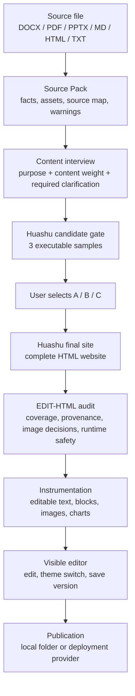
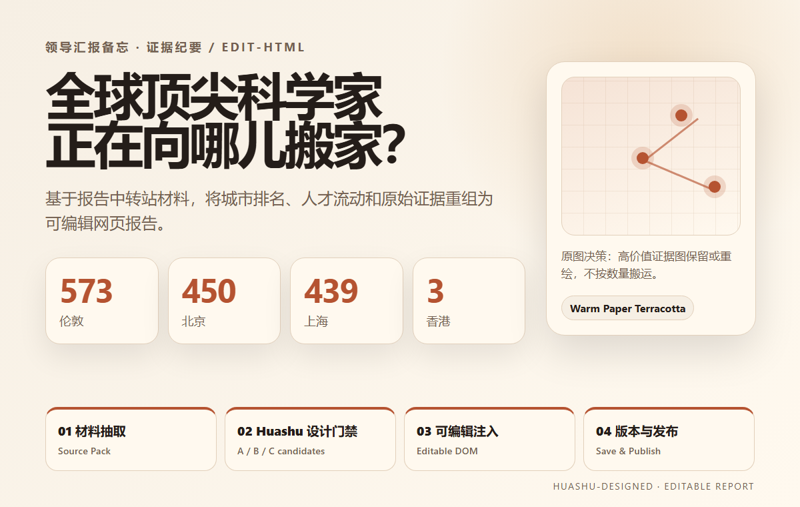
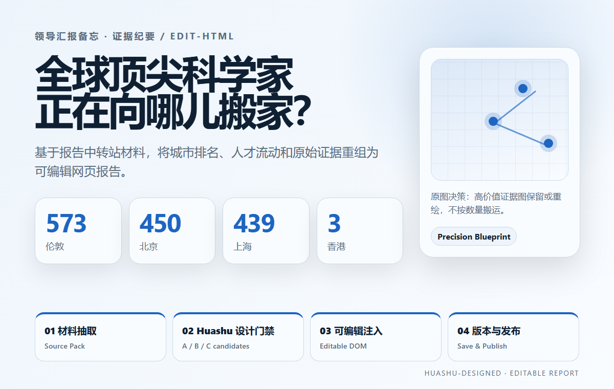
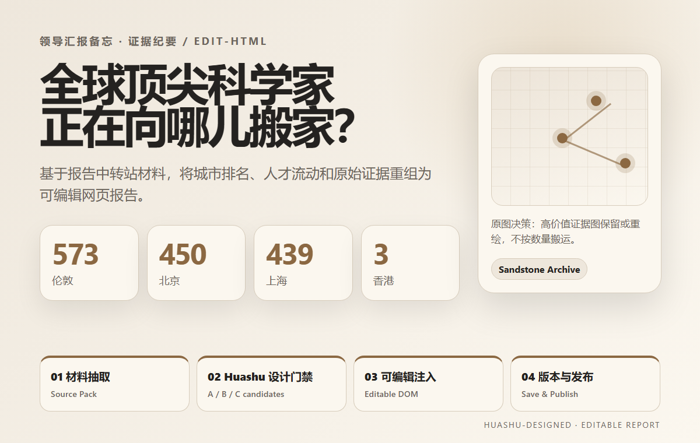
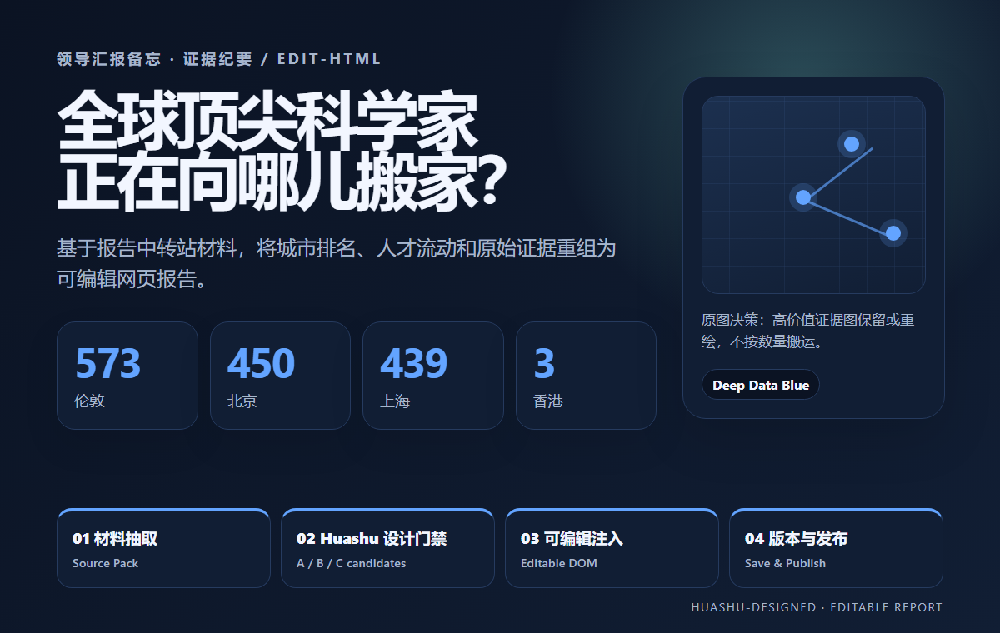
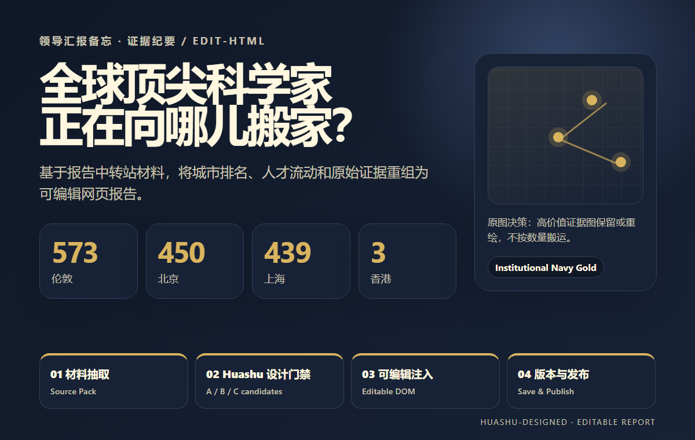
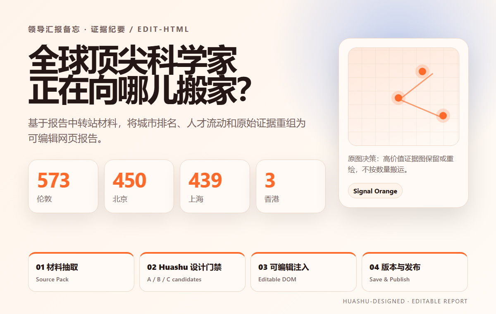

# EDIT-HTML

[English](README.md) | [中文](README.zh-CN.md)

EDIT-HTML turns research material into a Huashu-designed, source-closed, editable HTML report.

It is built for local agents that need to convert DOCX, PDF, PPTX, Markdown, HTML, or TXT into a polished web report without losing provenance, design control, editability, version history, or publication output.

## Why this skill exists

Most document-to-web workflows fail in one of two ways:

- they preserve facts but produce generic model-designed pages;
- or they produce attractive pages while losing source traceability and edit/publish safety.

EDIT-HTML separates those responsibilities:

- Huashu owns the actual design: narrative structure, layout, DOM, CSS, interaction, visualization, responsive behavior, and design taste.
- EDIT-HTML owns extraction, receipts, provenance, audit gates, instrumentation, editor runtime, immutable versions, and publication.

The result is a report that can be inspected, edited, saved, restored, and published after generation.

## Main workflow



The important rule is simple: Huashu designs the website; EDIT-HTML verifies and instruments it without redesigning it.

## What makes EDIT-HTML different

### Huashu-first design gate

The workflow does not let the model silently invent the final report layout. Huashu must be invoked before candidate generation and again before final site generation. Candidate and final packages require execution receipts tied to the Huashu skill hash, input receipt, challenge, and output hash.

### Source-closed reporting

Every substantive visible claim is bound back to the Source Pack. Titles, grouping, hierarchy, compression, and explanation may change, but facts, numbers, units, time ranges, qualifications, and relationships may not.

### Explicit image judgment

Source images are not copied blindly. Huashu must decide whether each source image should be used as original evidence, redrawn, referenced only, or omitted. This keeps strong source visuals while avoiding decorative or repetitive image dumping.

### Editable HTML output

The final artifact is not a static screenshot. The editor exposes scoped actions for:

- text editing;
- block movement, duplication, and deletion;
- image replacement;
- serializable chart data editing.

Palette changes update the current iframe in place, and the instrumenter preserves Huashu's DOM hierarchy, geometry, typography, charts, and interactions.

### Versioning and publishing

Saving creates immutable internal versions. Publishing works from saved versions only and produces recoverable publication records:

- local publish creates `publications/<publication-id>/report.html`;
- domain publish can use deployment providers when credentials are available;
- the editor can reveal the local publication folder directly.

### Agent and OS compatibility

V5.4 keeps the V5.3.2 production flow while hardening execution across Codex, Claude Code, Workbuddy-style agents, Windows, and macOS. An agent must be able to run local shell commands, preserve receipt files, read/write the project, access the real `huashu-design/SKILL.md`, and report or open the authenticated editor URL.

## Install

```powershell
npm install
npm run install:local
```

The npm package and CLI remain `edit-html-report` for compatibility. The Codex skill name is `EDIT-HTML`.

## Basic usage

```powershell
edit-html-report doctor
edit-html-report create "input.docx" --out "my-report"
edit-html-report variant create "my-report"
```

Then follow the V5.4 flow:

1. inspect the Source Pack and extraction warnings;
2. record the content interview;
3. prepare the Huashu design input;
4. generate three executable candidates;
5. show exactly one desktop screenshot per candidate;
6. wait for the user's A/B/C selection;
7. generate the final Huashu site from the selected candidate;
8. import, verify, render, validate, and open the editor;
9. save a version and publish when ready.

## Useful commands

```powershell
edit-html-report design candidate review prepare "my-report" --variant "<variant-id>"
edit-html-report design candidate confirm "my-report" --variant "<variant-id>" --candidate "<candidate-id>" --receipt "selection-receipt.json"
edit-html-report design final verify "my-report" --variant "<variant-id>"
edit-html-report render "my-report" --variant "<variant-id>"
edit-html-report validate "my-report" --variant "<variant-id>"
edit-html-report editor open "my-report" --variant "<variant-id>"
```

## Validation

```powershell
npm run check
npm test
npm run test:e2e
npm pack --dry-run
```

## Six switchable palettes

The editor ships with six accessible report palettes. The previews below use the same report structure with different theme tokens.

<table>
  <tr>
    <td width="50%"><br><sub>Warm Paper Terracotta</sub></td>
    <td width="50%"><br><sub>Precision Blueprint</sub></td>
  </tr>
  <tr>
    <td width="50%"><br><sub>Sandstone Archive</sub></td>
    <td width="50%"><br><sub>Deep Data Blue</sub></td>
  </tr>
  <tr>
    <td width="50%"><br><sub>Institutional Navy Gold</sub></td>
    <td width="50%"><br><sub>Signal Orange</sub></td>
  </tr>
</table>
