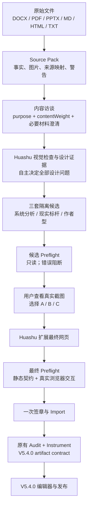

# EDIT-HTML

[English](README.md) | [中文](README.zh-CN.md)

EDIT-HTML 是一个把研究材料转换成高质量网页报告的本地 Skill。

它处理 DOCX、PDF、PPTX、Markdown、HTML、TXT 等输入，输出由 Huashu 负责设计、由 EDIT-HTML 负责审计和注入编辑能力的 HTML 报告。目标不是“把文档转成网页壳子”，而是形成一个可检查、可编辑、可保存版本、可发布的本地网页工作流。

## 核心定位

EDIT-HTML 的关键设计是分权：

- Huashu 负责网页本身的设计判断：叙事结构、版式、DOM、CSS、交互、图表、响应式和视觉语言。
- EDIT-HTML 负责工程链路：资料抽取、来源闭环、执行回执、审计门禁、HTML 注入、编辑器、版本和发布。

这样做的目的很直接：避免模型自己临场设计，也避免漂亮页面失去来源约束和后续编辑能力。

## 运行流程



简化理解：

1. 先把材料拆成 Source Pack。
2. 只问内容问题，不问用户设计问题。
3. Huashu 逐图视觉评估并给出三套独立的 A/B/C 可执行设计方向。
4. 候选 Preflight 只读检查，用户只在看到真实截图后选择方向。
5. Huashu 扩展最终网页，最终 Preflight 通过后再一次性签章、导入。
6. EDIT-HTML 沿用 V5.4.0 审计、注入、编辑器和发布边界，不重写 Huashu 的设计。

## 特色

### Huashu 设计原则

V5.4.1 要求候选页和最终页都经过 Huashu begin / preflight / attest 门禁。用户只主导内容，不回答位置、版式、风格、字体、图片使用、交互或 Junior pass 等设计问题；Huashu 自主应用设计原则。Preflight 在不可变签章前返回全部诊断，错误阻断、审美警告不阻断。

### 来源闭环

网页可以改标题、重组层级、压缩表达，但不能改事实。每个可见的重要数字、时间、单位、限定词和事实关系，都需要回到 Source Pack 里的来源。审计失败时，流程返回诊断，而不是静默修页面。

### 原图不是按数量搬运

材料里的图片需要判断价值，不是“有多少搬多少”。Huashu 对每张 Source Pack 图片做决策：

- 原图使用；
- 重绘；
- 仅参考；
- 省略。

判断前必须实际查看图片，不能只读文件名或图注。`huashu-design-evidence.json` 记录视觉描述、内容角色、信息损失、价值、处理方式和逐图独立理由。高价值证据图必须被使用或绑定来源重绘；高信息损失的证据、技术解释和区域案例图不能直接省略。全部判低或最终不用内容图仅提示警告，由 Huashu 决定是否调整。

### 生成后仍可编辑

最终输出不是死网页。编辑器支持：

- 文本编辑；
- 区块移动、复制、删除；
- 图片替换；
- 可序列化图表的数据编辑；
- 6 套配色切换。

配色修改会直接更新当前 iframe；注入器只添加编辑能力和来源标记，不破坏 Huashu 的 DOM、排版、字体、图表和交互。

### 版本和发布

编辑器保存的是不可变版本。发布从已保存版本开始，避免把未保存草稿直接发出去。

本地发布会生成：

- `publications/<publication-id>/report.html`
- `publications/<publication-id>/publication.json`

保存版本后，发布面板提供本地发布、域名发布、打开本地发布文件夹、删除保存版本文件等操作。

### 兼容 Codex / Claude Code / Workbuddy

V5.4 的重点是兼容性加固。只要 agent 能运行本地 shell、读写项目、保留 receipt、访问真实 `huashu-design/SKILL.md`，并能打开或报告本地编辑器 URL，就可以执行同一套流程。Windows 和 macOS 都按同一执行契约处理。

## 安装

```powershell
npm install
npm run install:local
```

为了兼容旧链路，npm 包名和 CLI 命令仍是 `edit-html-report`；Codex Skill 名称是 `EDIT-HTML`。

## 基本用法

```powershell
edit-html-report doctor
edit-html-report create "input.docx" --out "my-report"
edit-html-report variant create "my-report"
```

常用后续命令：

```powershell
edit-html-report design preflight candidate "my-report" --variant "<variant-id>" --from "candidate-set"
edit-html-report design candidate review prepare "my-report" --variant "<variant-id>"
edit-html-report design candidate confirm "my-report" --variant "<variant-id>" --candidate "<candidate-id>" --receipt "selection-receipt.json"
edit-html-report design preflight final "my-report" --variant "<variant-id>" --from "final-site"
edit-html-report design final verify "my-report" --variant "<variant-id>"
edit-html-report render "my-report" --variant "<variant-id>"
edit-html-report validate "my-report" --variant "<variant-id>"
edit-html-report editor open "my-report" --variant "<variant-id>"
```

## 验证

```powershell
npm run check
npm test
npm run test:e2e
npm pack --dry-run
```

## 6 套可切换配色

下面是编辑器内置的 6 套报告配色。同一份网页结构可以在编辑器里切换不同主题。

<table>
  <tr>
    <td width="50%"><br><sub>Warm Paper Terracotta</sub></td>
    <td width="50%"><br><sub>Precision Blueprint</sub></td>
  </tr>
  <tr>
    <td width="50%"><br><sub>Sandstone Archive</sub></td>
    <td width="50%"><br><sub>Deep Data Blue</sub></td>
  </tr>
  <tr>
    <td width="50%"><br><sub>Institutional Navy Gold</sub></td>
    <td width="50%"><br><sub>Signal Orange</sub></td>
  </tr>
</table>
