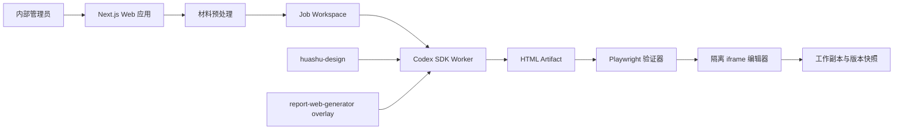

# Codex 报告网页生成器 MVP 设计规格

## 1. 结论

本 MVP 采用 **B+：Skill-first HTML Artifact** 路线。

`huashu-design` 继续负责报告内容重构、页面规划、视觉设计和 HTML 生成；应用层只增加材料入口、运行编排、标准输出协议、受约束编辑、版本留存和发布预留。MVP 不先把 `huashu-design` 重写成结构化 React 渲染器，也不承诺竖版网页和 16:9 HTML PPT 在任意人工编辑后无损互转。

MVP 的 Codex 运行面采用服务端 `@openai/codex-sdk`：

- Codex 官方将 SDK 定位为把 Codex 集成到内部工具、工作流和应用中的服务端能力；Node.js 要求为 18 或以上。
- 仓库级工作流放在 `.agents/skills`，由 Codex 自动发现。
- Web 应用显式调用 `$report-web-generator`，该 Skill 再要求使用 `$huashu-design`。
- `codex exec` 仅作为开发诊断和紧急回退入口，不作为 Web 应用主链路。
- 不使用 Codex App Server；它适合需要完整对话、审批和流事件协议的深度客户端集成，超出本 MVP 范围。

## 2. 产品目标

内部单管理员通过浏览器完成以下闭环：

1. 上传 DOCX、可复制文字的 PDF 或 PPTX。
2. 选择三种风格之一：研究出版、未来科技、咨询汇报。
3. 选择生成形态：竖版网页或 16:9 HTML PPT。
4. 由 Codex 调用 `huashu-design` 生成完整 HTML Artifact。
5. 在浏览器中直接修改允许编辑的文字和图片，调整章节或页面顺序。
6. 自动保存工作副本，并可建立、查看、恢复历史版本。
7. 为第三阶段发布保留 Artifact 与路由模型，但 MVP 不开放正式发布按钮。

## 3. MVP 成功标准

一次完整验收必须证明：

- 三类输入各至少有一个真实样本完成上传和预处理。
- 三种风格均能生成竖版网页；至少一种风格能生成不少于 5 页的 HTML PPT。
- 生成产物能在隔离 iframe 中加载，控制台无未处理异常，关键图片无 404。
- 用户能修改一个标题、一段正文和一张图片；刷新后修改仍存在。
- 用户能调整一个竖版章节或 PPT 页面顺序。
- 用户能建立两个版本，并从旧版本恢复；恢复动作本身生成新版本，不覆盖历史。
- 原始上传文件、生成产物和历史版本互相隔离。
- 生成失败不会破坏上一版可用 Artifact。

## 4. 明确不做

- 扫描 PDF OCR、旧版 `.doc`/`.ppt`、复杂公式识别。
- 任意坐标拖拽、图层面板、自由修改 CSS、Figma/PPT 级画布。
- 多人实时协作、评论、审批和租户隔离。
- 任意第三方 HTML 导入。
- PPTX 反向导出。
- 竖版与 PPT 的即时无损互转。
- 正式域名发布、Vercel 一键发布和公开分享链接。
- 自动事实核验；MVP 只保持来源索引和“未核验”状态。

## 5. 总体架构



### 5.1 Web 应用

- Next.js + TypeScript。
- React 编辑器界面。
- 服务端 Route Handlers 提供项目、上传、生成、编辑和版本 API。
- Server-Sent Events 推送生成进度；MVP 不需要 WebSocket。
- 单管理员登录，凭环境变量配置的密码建立 HttpOnly 会话。

### 5.2 Codex Worker

- 服务端安装 `@openai/codex-sdk`。
- 单并发队列；一次只运行一个生成任务。
- 每个任务拥有独立 Git 工作目录和 `workspace-write` 权限。
- SDK 线程工作目录指向任务目录，只允许写入该目录。
- Prompt 显式要求使用 `$report-web-generator` 和 `$huashu-design`。
- 线程 ID、最终回复、错误和耗时写入任务记录。

### 5.3 数据与文件

- SQLite 保存单管理员 MVP 的元数据。
- 本地持久卷保存上传、工作目录和 Artifact。
- 文件内容用 SHA-256 寻址，重复图片可复用。
- 迁移云存储时保持 `BlobStore` 接口不变，替换为 S3 实现。

## 6. 仓库结构

```text
edit-ppt/
├── .agents/
│   └── skills/
│       ├── huashu-design/                 # 固定上游版本，MIT
│       └── report-web-generator/
│           ├── SKILL.md                   # B+ 叠加规则
│           ├── agents/openai.yaml
│           ├── references/
│           │   ├── artifact-contract.md
│           │   ├── style-research-editorial.md
│           │   ├── style-future-tech.md
│           │   └── style-consulting.md
│           └── scripts/
│               ├── inject-edit-contract.mjs
│               └── verify-artifact.mjs
├── app/
│   ├── (auth)/login/page.tsx
│   ├── projects/page.tsx
│   ├── projects/[projectId]/page.tsx
│   └── api/
├── src/
│   ├── auth/
│   ├── db/
│   ├── projects/
│   ├── jobs/
│   ├── codex/
│   ├── artifacts/
│   ├── editor/
│   ├── versions/
│   └── validation/
├── public/editor-runtime/
│   └── editor-bridge.js
├── prisma/schema.prisma
├── data/                                  # gitignored，持久卷
├── tests/
│   ├── unit/
│   ├── integration/
│   ├── fixtures/
│   └── e2e/
└── docs/
```

## 7. 两个 Skill 的职责

### 7.1 `huashu-design`

保持上游主要工作流：

- 从真实材料和设计上下文出发。
- 内容图片优先使用原材料资产。
- 避免 AI slop。
- 竖版与 PPT 使用不同布局逻辑。
- PPT 使用固定尺寸、自动缩放、键盘翻页和播放位置记忆。
- 产出后用 Playwright 检查。

上游目录固定到明确 commit，并保留许可证；升级必须经过回归样本测试，不能直接跟随 `master`。

### 7.2 `report-web-generator`

这是 MVP 的协议叠加层，不复制 `huashu-design` 的全部审美指令。它强制：

1. 只读取当前任务的 `source/`、`brief.json` 和 `source-index.json`。
2. 将产物写入 `artifact/`。
3. 三种风格只允许使用本规格定义的锚点。
4. 竖版输出 `artifact/index.html`；PPT 输出 `artifact/index.html` 和 `artifact/pages/*.html`。
5. 所有本地图片放入 `artifact/assets/`，禁止引用任务目录之外的本地路径。
6. 文字和图片候选节点必须有稳定的 `data-edit-id`。
7. 可排序的顶层块必须有 `data-block-id` 和 `data-block-parent`。
8. 生成 `artifact/edit-manifest.json` 和 `artifact/generation.json`。
9. 不得写入密钥、绝对路径和用户机器信息。
10. 输出前运行注入器和验证器；验证不通过不得标记成功。

## 8. 材料预处理

预处理不是重新做完整文档理解系统，它只为 Codex 提供稳定、可追溯的输入包。

```text
job/source/
├── original.docx
├── content.md
├── source-index.json
├── assets/
│   ├── image-001.png
│   └── image-002.jpg
└── tables/
    └── table-001.csv
```

`source-index.json` 的最小结构：

```json
{
  "schemaVersion": 1,
  "originalFile": "original.docx",
  "pages": [
    {
      "sourceId": "src-p001",
      "page": 1,
      "heading": "第一章",
      "markdownStartLine": 1,
      "markdownEndLine": 48,
      "assets": ["assets/image-001.png"]
    }
  ]
}
```

处理策略：

- DOCX：提取标题层级、段落、表格、图片和文档顺序。
- 文本 PDF：提取页级文本和图片，保留页码；若文本密度过低则拒绝并提示可能为扫描件。
- PPTX：每张幻灯片转成一个来源单元，提取文字、图片和备注，不追求像素级还原。
- 表格同时保留 Markdown 版本与 CSV，方便 Codex选择直接表格或图表。
- 页眉页脚只做规则化去重，不做模型推断删除。

## 9. 生成 Brief

Web 应用将用户选择写入 `brief.json`：

```json
{
  "schemaVersion": 1,
  "projectId": "prj_01",
  "jobId": "job_01",
  "title": "AI服务器核心材料专题研究报告",
  "style": "research-editorial",
  "mode": "web",
  "language": "zh-CN",
  "audience": "产业研究与决策人员",
  "factPolicy": "source-only-unverified",
  "editable": {
    "text": true,
    "images": true,
    "topLevelOrder": true
  }
}
```

枚举值：

- `style`: `research-editorial | future-tech | consulting`
- `mode`: `web | slides`
- `factPolicy`: MVP 固定为 `source-only-unverified`

## 10. 三种风格

### 10.1 研究出版

视觉锚点为本地示例 `ai-server-materials-report.html`：

- 暖纸底、细网格或纸张纹理。
- 大幅中文衬线标题与克制的赤陶色强调。
- 高密度但保持长文可读性。
- 数据、图表、图片和正文以编辑出版节奏编排。
- 不把主题切换按钮复制到最终产物；主题由生成 Brief 决定。

### 10.2 未来科技

视觉锚点为 `https://szai-report-fxtqjsgp.manus.space/`：

- 深海军蓝背景，亮蓝与青色作为少量强调。
- 顶部章节导航、科技主题 Hero、指标卡和深色图表。
- 可使用真实原材料科技图片；不能用通用紫色霓虹替代内容图。
- 卡片边界以低对比细线为主，避免过度发光。
- 移除第三方品牌和 “Made with Manus” 元素。

### 10.3 咨询汇报

由本项目设计：

- 暖白或浅灰底、深蓝主色、单一砖红或绿色强调。
- 每一屏使用结论式 action title。
- 图表和证据优先，装饰最少。
- 正文无衬线，章节标题可使用克制衬线形成层级。
- 竖版采用执行摘要、关键发现、证据和建议的咨询报告结构。
- PPT 采用封面、执行摘要、章节页、断言—证据页、建议页五类母版。

## 11. HTML Artifact 合约

### 11.1 目录

竖版：

```text
artifact/
├── index.html
├── assets/
├── edit-manifest.json
├── generation.json
└── preview.png
```

PPT：

```text
artifact/
├── index.html
├── pages/
│   ├── 01-cover.html
│   └── 02-summary.html
├── assets/
├── edit-manifest.json
├── generation.json
└── preview.png
```

### 11.2 `generation.json`

```json
{
  "schemaVersion": 1,
  "artifactId": "art_01",
  "projectId": "prj_01",
  "jobId": "job_01",
  "style": "research-editorial",
  "mode": "web",
  "entry": "index.html",
  "generator": "codex+report-web-generator+huashu-design",
  "sourceDigest": "sha256:...",
  "createdAt": "2026-07-10T00:00:00.000Z",
  "verification": {
    "status": "passed",
    "report": "verification.json"
  }
}
```

### 11.3 `edit-manifest.json`

```json
{
  "schemaVersion": 1,
  "artifactId": "art_01",
  "mode": "web",
  "files": ["index.html"],
  "nodes": [
    {
      "id": "cover-title",
      "file": "index.html",
      "kind": "text",
      "selector": "[data-edit-id='cover-title']",
      "format": "plain",
      "maxLength": 80,
      "sourceRefs": ["src-p001"]
    },
    {
      "id": "supply-chain-image",
      "file": "index.html",
      "kind": "image",
      "selector": "[data-edit-id='supply-chain-image']",
      "accept": ["image/png", "image/jpeg", "image/webp"],
      "sourceRefs": ["src-p006"]
    }
  ],
  "blocks": [
    {
      "id": "section-market",
      "file": "index.html",
      "selector": "[data-block-id='section-market']",
      "parent": "report-root",
      "sortable": true
    }
  ]
}
```

### 11.4 稳定性规则

- `data-edit-id`、`data-block-id` 在同一 Artifact 内唯一。
- selector 必须恰好命中一个节点；验证器会检查。
- 编辑 ID 是语义名称，禁止随机 DOM 序号。
- 编辑器不依赖 CSS class，因为 Skill 迭代可能修改 class。
- PPT 节点必须同时记录具体页面文件。
- 生成后由确定性脚本补齐 manifest；不能只相信模型手写 JSON。

## 12. 编辑器

### 12.1 安全边界

- Artifact 在 `sandbox="allow-scripts"` iframe 中运行，不授予 `allow-same-origin`。
- Artifact 页面不携带应用 Cookie。
- 父页面和 iframe 只通过带随机 `channelToken` 的 `postMessage` 通信。
- CSP 默认 `default-src 'self' data: blob:`；允许下载后的本地字体和图片，不允许任意远程脚本。
- 生成产物中的表单提交、顶层导航、弹窗和下载 API 被禁用。

### 12.2 编辑操作

文字：

- 单击高亮可编辑节点。
- 双击进入局部编辑。
- 支持纯文本；正文节点额外支持加粗、斜体、链接和列表。
- 保存时发送结构化 patch，不直接上传整页 HTML。

图片：

- 上传替换 JPEG、PNG、WebP。
- 修改 alt、图注和 `object-position`。
- MVP 不提供滤镜、抠图和复杂裁剪。

顺序：

- 竖版仅允许同一父容器下的顶层章节排序。
- PPT 允许页面排序；排序后同步更新 `index.html` 的 manifest。
- 不允许跨容器拖动任意内部 DOM。

### 12.3 Patch 协议

```json
{
  "baseRevision": 17,
  "operations": [
    {
      "op": "replaceText",
      "nodeId": "cover-title",
      "value": "新的报告标题"
    },
    {
      "op": "replaceImage",
      "nodeId": "supply-chain-image",
      "assetId": "asset_023",
      "alt": "产业链图谱"
    },
    {
      "op": "reorderBlocks",
      "parentId": "report-root",
      "blockIds": ["section-summary", "section-market", "section-policy"]
    }
  ]
}
```

服务端校验 `baseRevision`；版本冲突返回 409，客户端重新加载后再提交。

## 13. 版本模型

三层状态：

1. **Source**：原始上传文件，不可变。
2. **Working Artifact**：当前可编辑工作副本。
3. **Version Snapshot**：不可变快照。

快照触发：

- 生成成功后建立 `v1-generated`。
- 用户点击“保存版本”。
- 执行重新生成或恢复前自动建立保护快照。
- 连续编辑超过 5 分钟且有未快照变化时建立自动快照。

恢复规则：

- 恢复旧版本会复制旧快照成为新的 Working Artifact。
- 同时建立一个新的版本记录，例如 `v7-restored-from-v3`。
- 旧版本永不删除或覆写。

快照内容：

- HTML 文件。
- `assets/` 引用清单。
- `edit-manifest.json`。
- `generation.json`。
- patch revision 和用户备注。

## 14. 数据模型

SQLite 表：

- `AdminSession`: 登录会话。
- `Project`: 项目标题、状态、当前 Artifact。
- `SourceFile`: 原文件路径、MIME、哈希、解析状态。
- `GenerationJob`: 风格、模式、状态、Codex thread ID、日志摘要。
- `Artifact`: 工作目录、入口文件、校验状态、当前 revision。
- `ArtifactAsset`: 文件路径、MIME、哈希、尺寸。
- `Patch`: revision、操作 JSON、创建时间。
- `Version`: 快照路径、来源版本、备注、内容哈希。

任务状态机：

```text
queued
  → preprocessing
  → running_codex
  → normalizing
  → verifying
  → ready

任一步 → failed
queued/running_codex → cancelled
```

失败状态保留错误阶段、错误码和可读摘要。

## 15. API

- `POST /api/login`
- `POST /api/logout`
- `GET /api/projects`
- `POST /api/projects`
- `GET /api/projects/:projectId`
- `POST /api/projects/:projectId/sources`
- `POST /api/projects/:projectId/generations`
- `GET /api/jobs/:jobId`
- `GET /api/jobs/:jobId/events`
- `POST /api/jobs/:jobId/cancel`
- `GET /api/artifacts/:artifactId/manifest`
- `GET /api/artifacts/:artifactId/runtime/*`
- `POST /api/artifacts/:artifactId/patches`
- `POST /api/artifacts/:artifactId/assets`
- `GET /api/artifacts/:artifactId/versions`
- `POST /api/artifacts/:artifactId/versions`
- `POST /api/artifacts/:artifactId/restore/:versionId`

`runtime/*` 只返回 Artifact 文件，使用独立 CSP 和无 Cookie 响应头。

## 16. Codex 生成流程

1. Web API 校验 Brief 和 SourceFile。
2. Worker 创建 `data/jobs/<jobId>/workspace` Git 仓库。
3. 将 `source/`、`brief.json`、`source-index.json` 复制进 workspace。
4. 确保仓库级两个 Skill 对 worker 可见。
5. 使用 Codex SDK 启动线程，权限为 workspace-write。
6. Prompt 要求：

```text
使用 $report-web-generator 和 $huashu-design。
读取 brief.json、source/content.md、source/source-index.json 和 source/assets。
只在 artifact/ 写入最终产物。
完成生成、编辑合约注入和 Playwright 验证。
验证失败时自行修复，最终仅在 verification.status=passed 时报告成功。
```

7. Worker 监听线程完成结果，并检查文件系统而不是只相信最终文字回复。
8. 运行确定性 `inject-edit-contract.mjs`。
9. 运行 `verify-artifact.mjs`。
10. 校验通过后原子移动为 Working Artifact，并建立初始版本。

## 17. 生成重试与人工编辑的关系

- “重新生成”永远创建新的 Job 和新的 Artifact，不在当前工作副本上原地生成。
- 用户可以选择：
  - 从原始材料重新生成。
  - 从当前编辑后 Artifact 提取内容再生成另一种风格。
  - 从当前编辑后 Artifact 生成另一种输出形态。
- 后两种是内容迁移，不保证布局继承。
- 生成成功后用户明确选择“替换当前”或“保留为分支版本”。MVP 默认保留为分支版本。

## 18. 错误处理

预处理失败：

- 不创建 GenerationJob。
- 返回不支持格式、扫描件疑似、文件损坏或超限。

Codex 失败：

- 保存线程 ID 和最后事件摘要。
- 工作目录保留 24 小时供诊断。
- 不创建可用 Artifact。

验证失败：

- 一次自动修复回合。
- 仍失败则标记 `failed_validation`，保留截图和报告。

编辑失败：

- manifest selector 失效时拒绝 patch，并提示“该节点已不可编辑”。
- revision 冲突返回 409。
- 图片失败不修改原图片。

## 19. 验证

确定性验证器必须检查：

- Artifact 目录和必需文件存在。
- HTML 不含任务目录外的绝对路径。
- `generation.json` 符合 JSON Schema。
- `edit-manifest.json` 符合 JSON Schema。
- 每个 selector 恰好匹配一个节点。
- 每个本地图片和字体都能成功加载。
- 页面控制台没有未处理错误。
- 竖版在 1440×900 和 390×844 两个视口可阅读，无横向溢出。
- PPT 每页 16:9、键盘左右翻页、页码和 localStorage 位置记忆正常。
- PPT 不少于 5 页时随机截图首、中、末三页。
- 编辑 bridge 能完成文字替换并发回 patch。

测试分层：

- 单元测试：Schema、patch 应用、版本恢复、路径安全。
- 集成测试：预处理、Codex runner mock、Artifact normalizer。
- E2E：上传 fixture、生成 mock artifact、编辑、保存版本、恢复。
- Skill 回归：三种风格 × 两种形态的固定提示词与截图基线。

## 20. 部署

### 20.1 MVP

单台受控 Linux VM 或内部容器主机：

- Next.js Web + Worker 同仓库、分进程运行。
- SQLite 和 `data/` 挂载持久卷。
- Codex SDK 只在 Worker 服务端可用。
- 管理密码、会话密钥和 Codex 凭据放入 secret manager 或主机环境，不进入 Artifact workspace。
- 反向代理提供 HTTPS 和内部访问限制。
- Worker 并发固定为 1。

不选择纯 Vercel Serverless：生成任务需要持续运行、可写工作目录、浏览器验证和 Codex 本地 agent，不符合短生命周期函数约束。

### 20.2 第三阶段发布预留

表中预留：

- `Project.publishSlug`
- `Artifact.publishStatus`
- `Artifact.publishedVersionId`

未来发布只允许不可变 Version Snapshot，不直接发布 Working Artifact。发布器可将快照复制到同域名静态目录，或导出 ZIP 供 Vercel/Netlify 使用。

## 21. 安全

- 上传限制为允许 MIME，单文件默认不超过 100 MB。
- 解压 DOCX/PPTX 时限制文件数量、总解压尺寸和路径穿越。
- Codex 任务只获得当前 workspace-write 权限。
- Artifact 不获得应用密钥和数据库连接。
- 生成 HTML 禁止远程脚本；远程图片默认下载到本地并记录来源。
- 管理端所有 mutation 要求 CSRF 防护。
- 版本和工作目录路径全部通过数据库 ID 解析，不接受客户端绝对路径。
- 日志清除原文大段内容和密钥。

## 22. 可维护性与迁移

B+ 是有意识的 MVP 取舍，不掩盖其边界：

- HTML DOM 仍由 Agent 设计，编辑能力依赖 edit contract。
- 风格切换和输出形态切换需要重新生成。
- Skill 升级可能改变 DOM，因此必须固定版本和跑回归。

如果产品验证成功，迁移到结构化平台时保持以下接口：

- `SourcePackage`
- `GenerationBrief`
- `ArtifactContract`
- `PatchOperation`
- `VersionSnapshot`

未来可以逐步把高频 HTML 模块替换为结构化组件，而无需重做上传、任务、编辑通信和版本系统。

## 23. 实施顺序

1. Artifact 合约、Schema 和 fixture。
2. 仓库级两个 Skill 与 Codex SDK runner。
3. 材料预处理。
4. 项目、任务和 Artifact 存储。
5. 生成页面与进度。
6. 隔离预览和编辑 bridge。
7. Patch、图片和排序。
8. 版本快照与恢复。
9. Playwright 验证。
10. 三风格真实回归和内部部署。

## 24. 依据

- Codex SDK：`https://learn.chatgpt.com/docs/codex-sdk`
- Codex Skills：`https://learn.chatgpt.com/docs/build-skills`
- Codex App Server：`https://learn.chatgpt.com/docs/app-server`
- Codex Non-interactive mode：`https://learn.chatgpt.com/docs/non-interactive-mode`
- huashu-design：`https://github.com/alchaincyf/huashu-design`
- 未来科技参考：`https://szai-report-fxtqjsgp.manus.space/`
- 研究出版参考：`C:\Users\edchw\Documents\HTML SKILLS\ai-server-site\ai-server-materials-report.html`

